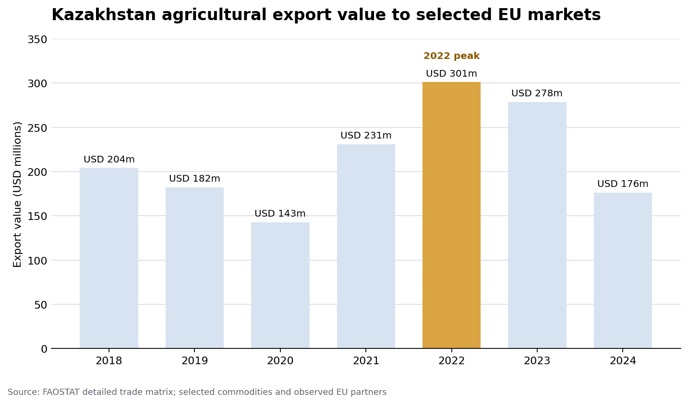

# Kazakhstan–EU Agricultural Trade Analysis

This project analyzes Kazakhstan's exports of selected agricultural commodities to EU partner markets from 2018 through 2024. It combines FAOSTAT detailed trade-matrix data with Kazakhstan production data to compare export performance, domestic output, harvested area, and yield.

## Research focus

The analysis examines:

- annual changes in export quantity and value;
- concentration by commodity and EU destination market;
- year-over-year trade and production growth;
- changes between 2018 and 2024; and
- the relationship between domestic production and exports to observed EU markets.

The results are descriptive. They identify patterns and questions for further research but do not establish causal effects.

## Key Findings

- Export value peaked in 2022 at approximately USD 301 million.
- Linseed and wheat dominate the selected agricultural export basket.
- Belgium and Italy dominate the observed EU destination markets.



## Repository structure

```text
.
├── data/
│   ├── raw/            # Source FAOSTAT CSV files
│   ├── processed/      # Cleaned and analysis-ready Parquet files
│   └── external/       # Optional supplementary data
├── docs/               # Written findings
├── notebooks/          # Data audits and exploratory analysis
├── outputs/
│   ├── figures/        # Generated charts
│   └── tables/         # Generated tables
├── sql/                # DuckDB exploration and analysis queries
├── src/                # Data preparation and SQL runner scripts
├── requirements.txt
└── README.md
```

## Setup

Python 3.10 or later is recommended.

```bash
python -m venv .venv
source .venv/bin/activate
python -m pip install -r requirements.txt
```

Run commands from the repository root so the relative data paths used by the scripts and SQL files resolve correctly.

## Reproduce the data pipeline

Clean the raw CSV files:

```bash
python src/clean_data.py
```

Create the analysis-ready trade and production datasets:

```bash
python src/prepare_trade_dataset.py
python src/prepare_prod_dataset.py
```

The preparation scripts validate expected measures, required output columns, and unique analytical keys before writing the processed Parquet files.

## Run the SQL analysis

The SQL files are ordered by analysis stage:

1. `sql/01_data_exploration.sql` — trade-data coverage and quality checks
2. `sql/02_trade_analysis.sql` — annual, commodity, and partner trends
3. `sql/03_prod_exploration.sql` — production-data coverage and quality checks
4. `sql/04_prod_analysis.sql` — production trends and growth
5. `sql/05_trade_prod_analysis.sql` — combined trade and production analysis

Run any file with the DuckDB helper:

```bash
python src/run_sql.py sql/02_trade_analysis.sql
```

Running the helper without an argument executes `sql/05_trade_prod_analysis.sql`.

## Data quality decisions

- Column names are normalized to lowercase snake case.
- Leading and trailing whitespace is removed from text fields.
- `year` and `value` are converted to numeric types.
- Exact duplicate source rows are removed during cleaning.
- Rows without a reported `value` are excluded during analytical preparation.
- Processed oil commodities retain expected missing harvested-area and yield values.
- No project-specific records are removed during the initial cleaning stage.

See [`docs/findings.md`](docs/findings.md) for the current descriptive findings.

## License

The code and original documentation in this repository are licensed under the
MIT License. See [LICENSE](LICENSE) for details.

This project uses data obtained from FAOSTAT. The underlying FAOSTAT datasets
are not covered by this repository's MIT License and remain subject to the
terms and licensing conditions of their original provider.
